# Slotly
A full-stack appointment booking system that allows students to schedule meetings with professors, join courses, and manage events.

## Table of Contents
- [Features](#features)
- [Tech Stack](#tech-stack)
- [Installation](#installation)
- [Usage](#usage)
- [Database Schema](#database-schema)
- [Screenshots](#screenshots)
- [Future Improvements](#future-improvements)

## Features

- **User Authentication** – Sign up, log in, and role-based access with JWT security.
- **Course Enrollment** – Students can join courses to view all related events in one place.
- **Appointment Management** – Create, edit, and cancel bookings with automatic conflict prevention.
- **Event Management** – Users can create, edit, and register for events.
- **Polling System** – Students can vote on polls, change votes, and view results in real time.

## Tech Stack

- **Frontend:** React Native, CSS
- **Backend:** Node.js, Express
- **Database:** MongoDB
- **Authentication:** JWT

## Installation

1. Clone the repo
```bash
git clone https://github.com/theaverage-coder/slotly.git
```

2. Install dependencies
```bash
cd slotly
npm install
```

3. Create a .env file with your environment variables
```bash
MONGO_URI=your_mongodb_uri
JWT_SECRET=your_secret
```

4. Run the app
```bash
npm run dev
```

## Database Schema

The app uses a MongoDB database with collections for:

- Users
- Courses
- Bookings
- Appointments
- Events
- Polls
- Votes
- Notifications

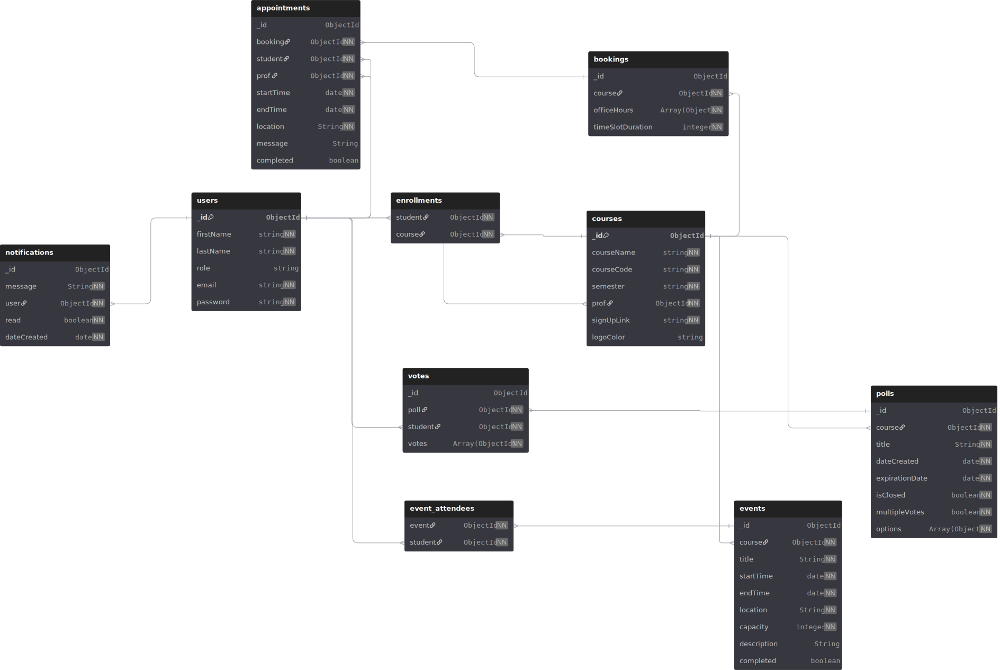

## Screenshots

### Secure user authentication with role-based access (students vs. professors), using JWT-based session management
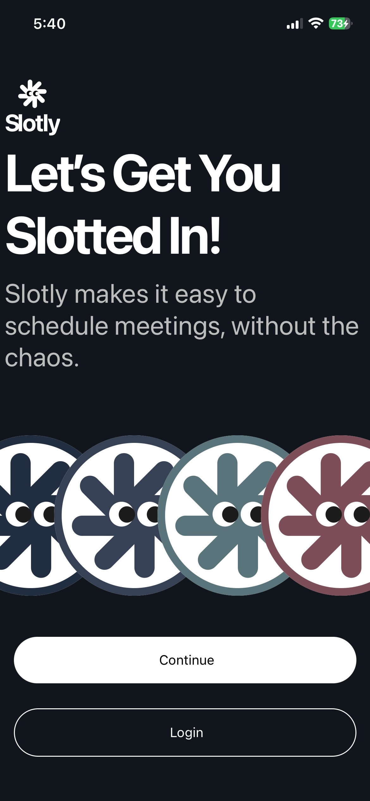 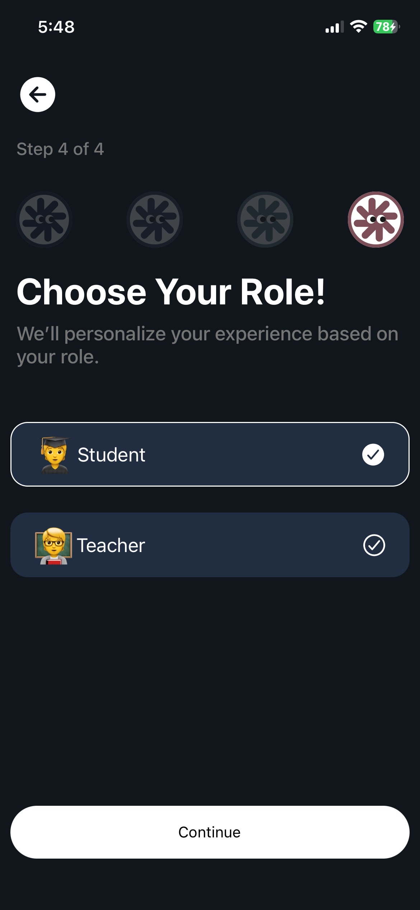 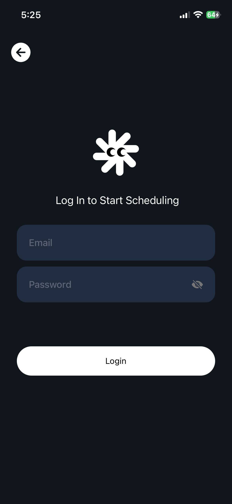


### Students can enroll in courses
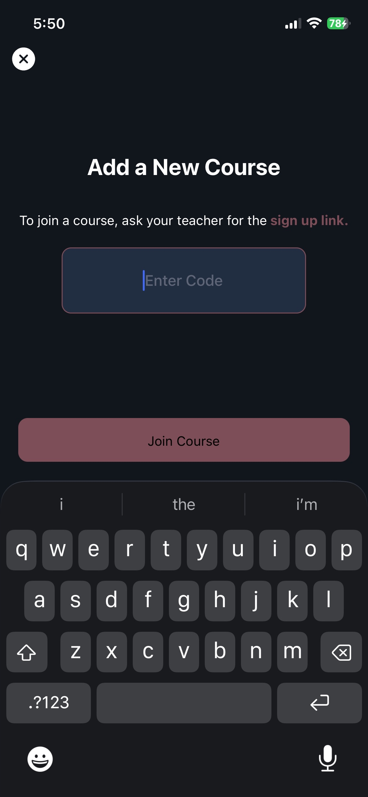 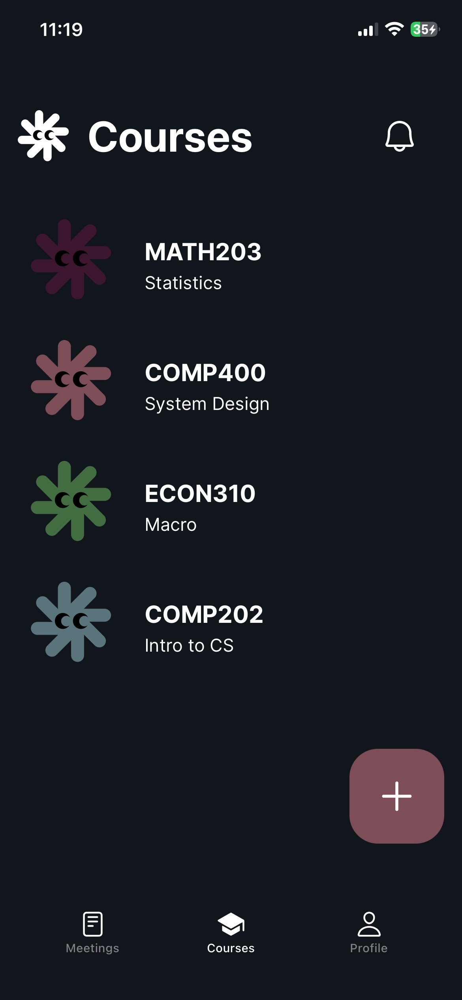 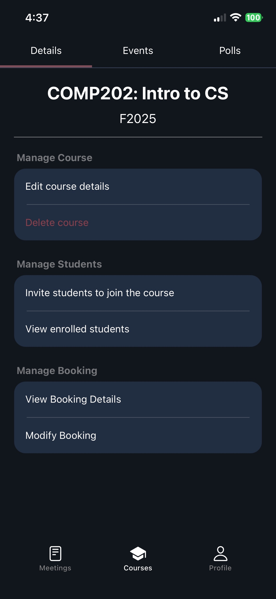

### Full booking management system allowing users to create, update, and cancel appointments
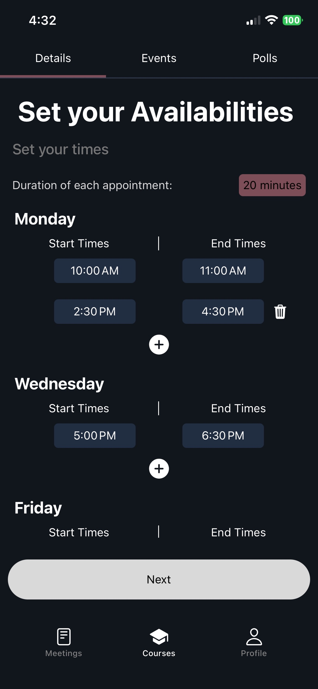 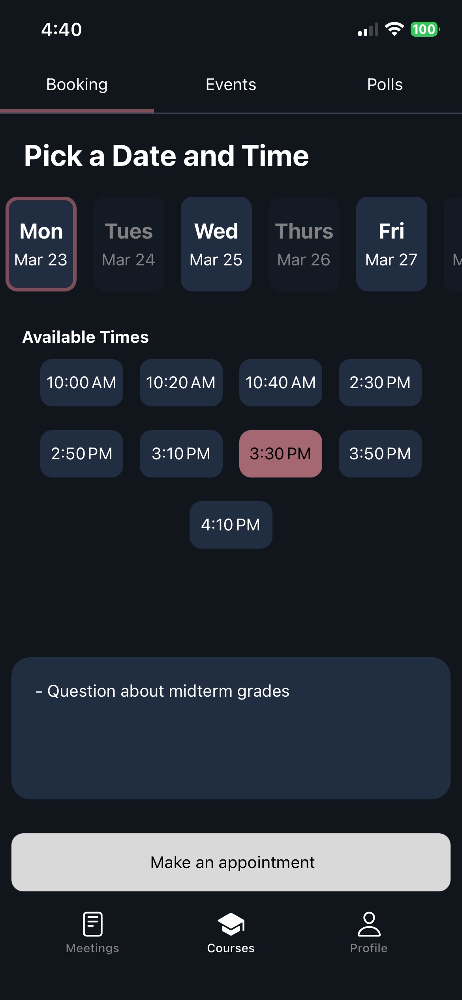 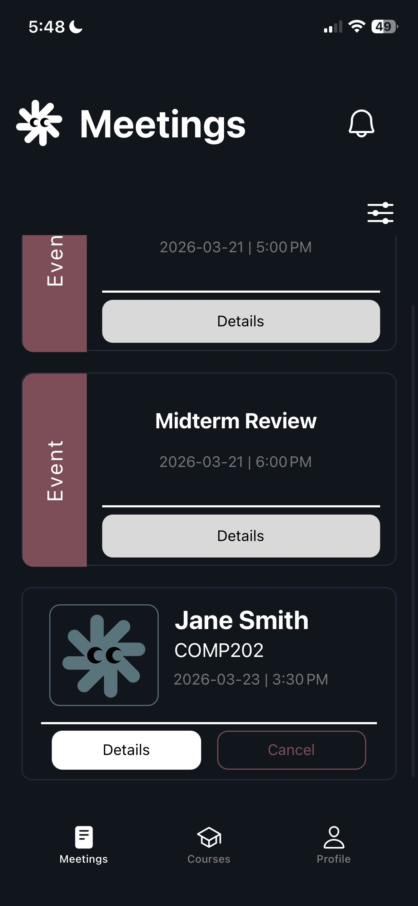

### Polling features and event sign ups
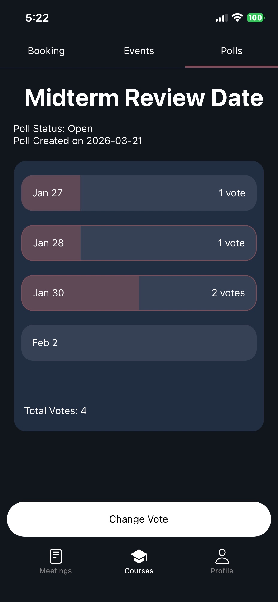 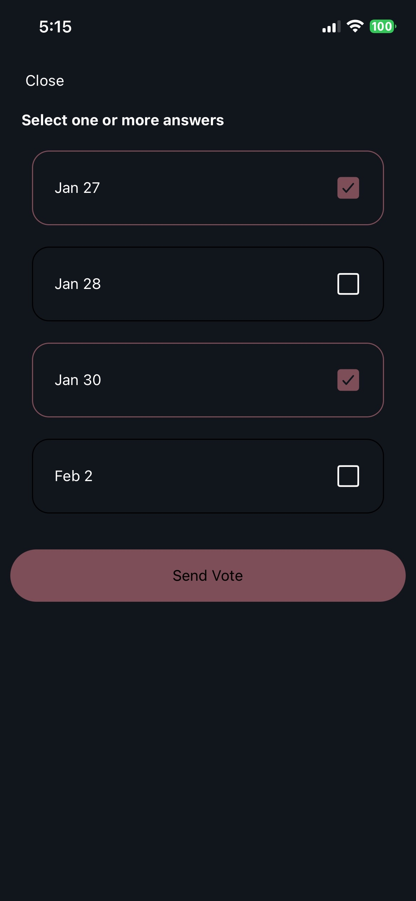 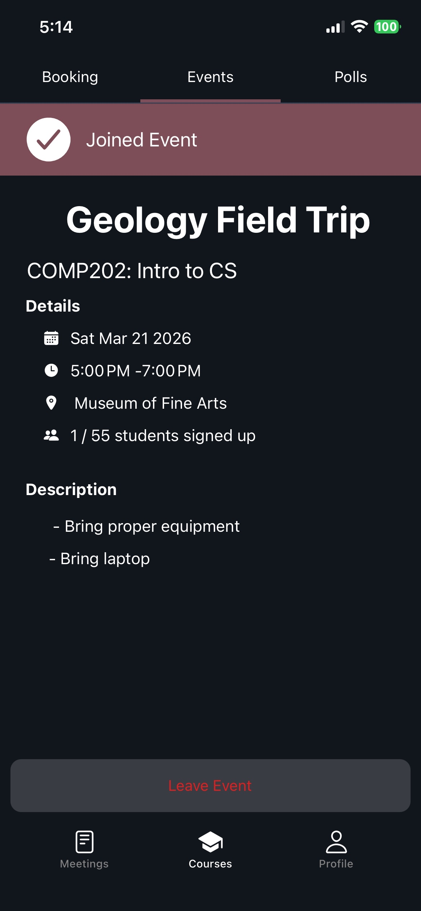


## Future Improvements
- Add email notifications for bookings and events
- Improve UI/UX for mobile devices
- Add feature to send alternate meeting requests for more flexibility